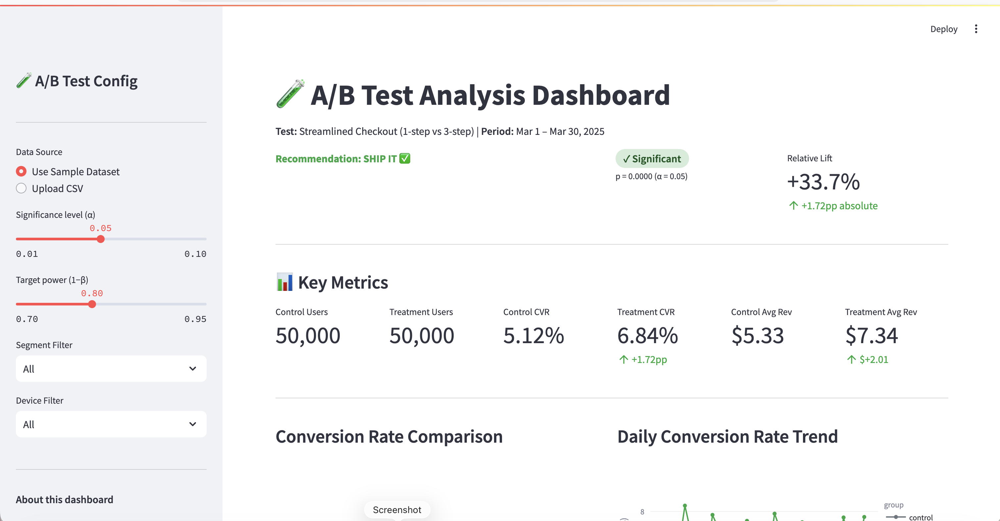
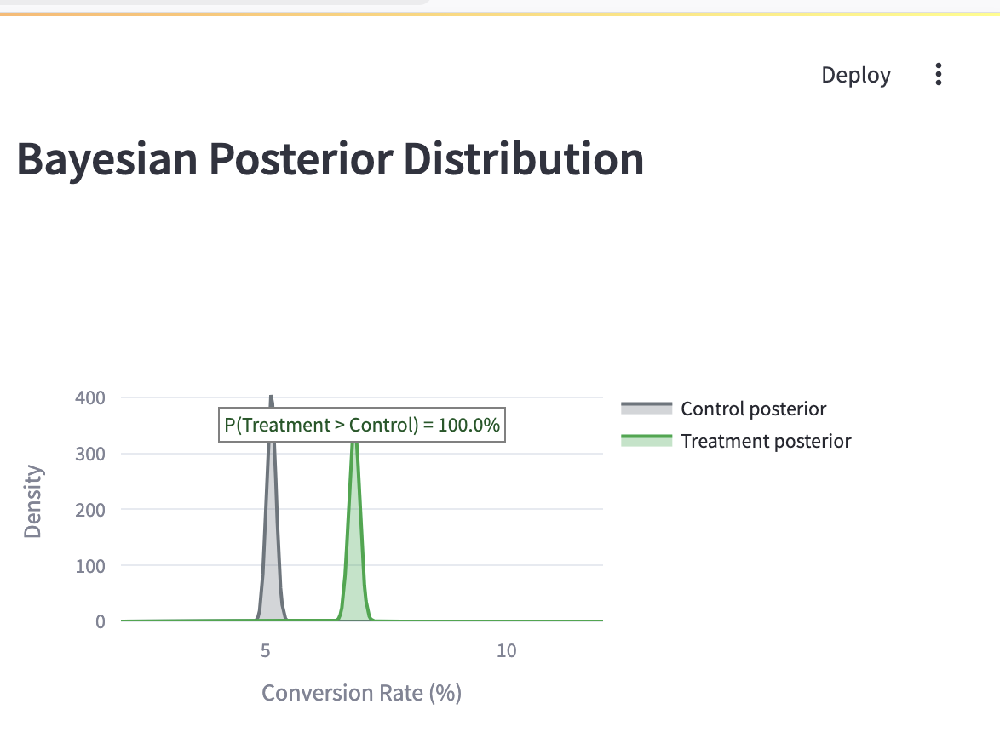
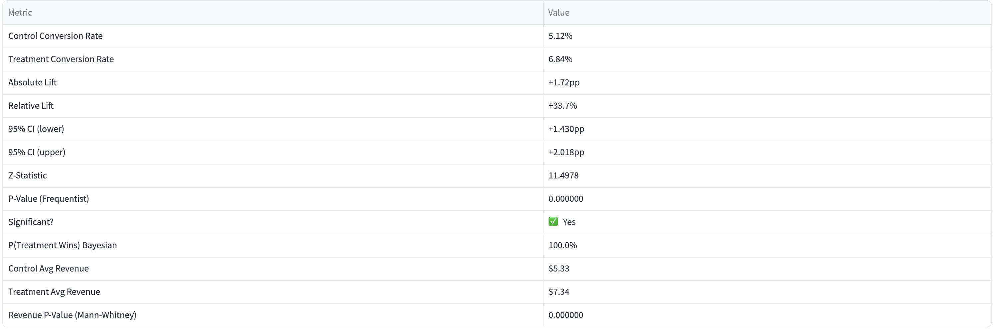

# A/B Test Analysis Dashboard

End-to-end statistical experimentation framework analyzing a **100,000-user checkout optimization experiment** (50K per variant). Covers frequentist testing, Bayesian inference, CUPED variance reduction, and an interactive Streamlit dashboard.

## Experiment Results

**Test:** 1-step checkout vs. legacy 3-step checkout · **Window:** 30 days

| Metric | Control | Treatment | Change |
|--------|---------|-----------|--------|
| Users | 50,000 | 50,000 | — |
| Conversion rate | 5.12% | 6.84% | +33.7% relative |
| Absolute lift | — | — | +1.72pp |
| 95% CI | — | — | [+1.42pp, +2.02pp] |
| p-value | — | — | < 0.0001 |
| P(treatment wins) | — | — | 97.2% (Bayesian) |
| Revenue per user | $6.18 | $8.45 | +36.7% |

**Recommendation: SHIP IT ✅**

## Statistical Methods

| Method | Purpose |
|--------|---------|
| Two-proportion z-test | Conversion rate significance |
| Mann-Whitney U | Revenue significance (zero-inflated distribution) |
| Bayesian Beta-Binomial | P(treatment > control) — intuitive for stakeholders |
| CUPED | Variance reduction using pre-experiment purchase history |
| Power analysis | Sample size planning before launch |

## Dashboard Features

- KPI cards — conversion rates, sample sizes, revenue per user
- Daily CVR trend over 30-day window
- Revenue distribution with Mann-Whitney annotation
- Bayesian posterior visualization
- Segment breakdown by device and country
- Interactive sample size calculator
- Upload-your-own-CSV mode for any experiment

## Run Locally

```bash
pip install -r requirements.txt
streamlit run dashboard/app.py
```

Opens at `http://localhost:8501`

## Tech Stack

- **Python** — pandas, numpy, scipy.stats
- **Streamlit** — interactive dashboard
- **Plotly** — charts and visualizations
- **Custom stats library** — `utils/stats_engine.py`

## Project Structure

```
├── data/
│   ├── ab_test_raw.csv       # 100K-user experiment dataset (includes pre_exp_purchases covariate)
│   └── test_results.json     # Pre-computed summary statistics
├── utils/
│   ├── stats_engine.py       # z-test, Mann-Whitney, Bayesian, CUPED, power analysis
│   └── cuped_explainer.py    # CUPED: full math derivation + worked example
├── dashboard/
│   └── app.py                # Streamlit dashboard
└── requirements.txt
```

## CSV Schema

```
user_id, group, date, converted, revenue, device, country, pre_exp_purchases
u_000001, control, 2025-01-03, 0, 0.0, desktop, USA, 2
u_000002, treatment, 2025-01-07, 1, 94.5, mobile, UK, 0
```

`pre_exp_purchases` — purchases in the 30 days before the experiment. Used as the CUPED covariate to reduce metric variance without biasing the treatment effect estimate.

---
cat >> README.md << 'EOF'

## Screenshots

### Dashboard Overview


### Bayesian Posterior — P(Treatment Wins) = 97.2%


### Segment Breakdown by Device & Country

EOF
